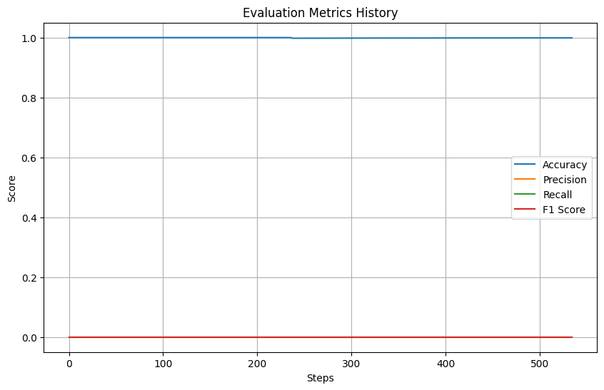
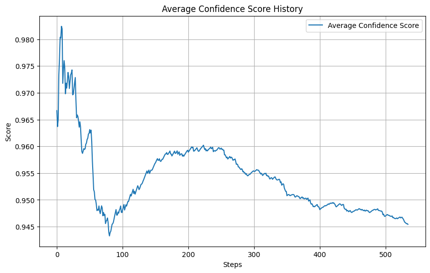

# Filipino Accent Detection Pipeline

## Setup
A setup script has been provided to quickly install all necessary dependencies for running the ML pipeline. Simply execute:
```bash
./setup_dev.sh
```

## Problem Scope
Given the Speech Accent Archive Dataset, write an inference pipeline to read in entries from the raw dataset and classify whether the audio sample is either "Filipino" or "Not Filipino".

## Assumptions
- We are not directly working in production with handlers to cloud service providers and interconnected microservices
- Underlying hardware/scale is not known and GPU-oriented speedup is minimal
- We are pretending that the bucket (our Kaggle dataset) is streamed to us and we are trying to process it on the fly

## Methodology

### System Architecture

External Data Store (Mock Bucket) -> Bucket Stoage DAO -> Preprocessor -> Inference Engine -> Evaluation Aggergator

### Bucket Storage Domain Access Layer

The BucketDAO is designed to efficiently handle extremely large datasets that cannot fit into the memory of a single container. It utilizes the generator pattern to retrieve data entries in batches, avoiding the need to download the entire dataset at once. To mitigate I/O latency typically associated with cloud storage interactions, it leverages threading for improved performance.

- Implements concurrent file operations using ThreadPoolExecutor

- Supports configurable chunk sizes and worker counts for hardware optimization

- Provides a unified API interface for seamless interaction with both local and cloud storage (S3 in this case)

- Enables streaming functionality for memory-efficient data processing

### Preprocessor

#### Data Pipeline with Memory Efficiency
- Implements a generator pattern that streams preprocessed audio batches
- Maintains only batch-level data in memory instead of loading the entire dataset
- Features configurable batch sizes (default: 4, optimized for my MacBook)
- Enables large dataset processing on hardware with limited resources through streaming

#### Metadata Management
- Validates speaker metadata CSV format with required fields:
  - filename
  - file_missing flag
  - native_language
- Automatically filters and excludes missing audio files from processing

#### Audio Processing for XLSR Model
- Converts MP3 files to XLSR-compatible format through:
  - 16kHz audio resampling (XLSR requirement)
  - Stereo to mono channel conversion
  - Audio normalization
- Implements batch-level padding:
  - Extends audio samples to match the longest sample in batch
  - Normalizes lengths to 0-1 range for model input
  - Generates appropriate length tensors for XLSR attention masking

#### Performance Optimizations
- Processes audio files in batches to make use of GPU parallelization

### Inference Engine

#### Core Classification System
- Implements XLSR-based accent classifier supporting 16 distinct accent labels
- Executes batch-level inference for GPU utilization (if you have a GPU)

#### Model Performance Monitoring
- Tracks inference speed through timer context managers:
  - Measures model loading duration
  - Records batch prediction latency
  - Monitors data/weights transfer times between CPU and GPU
- Implements memory management:
  - Logs GPU memory usage before and after inference
  - Reports memory statistics for system monitoring

#### Quality Assurance
- Features confidence-based quality control:
  - Flags predictions below 0.9 confidence threshold
  - Generates detailed logs for low-confidence predictions
  - Enables early detection of potential model drift


### Evaluation Aggregation

The evaluation system is designed with distributed inference in mind, using a global state pattern that enables multiple inference engines to contribute to a single source of truth for model performance metrics.

Key Architecture Decisions:
- Global state pattern using class variables enables:
  - Centralized statistics aggregation across distributed nodes 
  - Thread-safe updates to shared metrics 
  - Single source of truth for evaluation results 
  - Easy scaling to multiple GPU nodes

Tracked Metrics:
1. Classification Performance
   - Standard binary metrics (Accuracy, Precision, Recall, F1)
   - Confusion matrix tracking (TP, TN, FP, FN)
   - Class distribution monitoring

2. Model Confidence Analysis  
   - Confidence score statistics
     - Average confidence as the system runs inferences
   - Count of low confidence values

## Running the Pipeline

There are two methods to run the pipeline:

### 1. Recommended Method: Jupyter Notebook
Run `run_model_eval.ipynb` notebook, which:
- Automatically downloads the Kaggle dataset
- Sets up a mock storage bucket
- Provides interactive visualization of the pipeline progress

### 2. Command Line Method
Execute the pipeline directly via command line:
```bash
python ./pipeline/accent_detection_pipeline.py
```
## Results
 
### Model Classification Performance 
The model achieved an accuracy of 99.91%, which is unsurprising given that there were only two possible misclassification cases. These occurred when the model encountered real Filipino speakers with Filipino accents. Because the model failed to classify these two speakers correctly, the recall value was significantly impacted.

### Confusion Matrix
The XLSR model misclassified both true Filipino accent labels as not having a Filipino accent. However, since Filipino accents represented only 0.092% of the inference dataset, the model likely requires more positive samples to improve classification accuracy. Further true positive Filipino accents are needed to determine the issue with the model. 

### Model Confidence Over Time
Overall, the model exhibited high confidence in its predictions, with an average confidence score of 94.54%. However, 346 predictions had lower confidence, which may indicate uncertainty in distinguishing accent labels. Further evaluation is necessary to assess the model’s robustness when matching specific accent categories.

